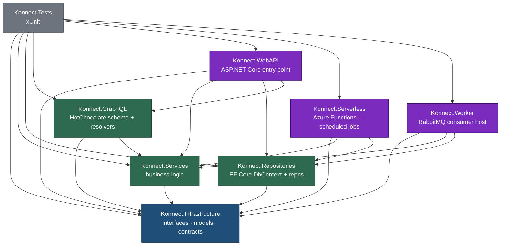

# Architecture

This page describes how the codebase is organised today. As features ship, this page (and the relevant infrastructure / API pages) gets updated in the same PR — the wiki stays in lockstep with what's actually implemented.

## Project layout

The .NET solution lives in [`Konnect.Platform/Konnect.Platform.slnx`](https://github.com/win-son-dev/konnect-server/blob/main/Konnect.Platform/Konnect.Platform.slnx). Eight projects with strict reference rules — every dependency is enforced at the project-reference level, so layering violations fail at compile time, not at code review.



| Project | Purpose | Reference rule |
|---|---|---|
| `Konnect.Infrastructure` | Interfaces, models, request/response contracts, constants. **No implementations** | Depends on nothing |
| `Konnect.Services` | Business logic. Implements interfaces from Infrastructure. Domain groupings (e.g. `Ai/`, `ResumeParsing/`, `SkillsGraph/`, `Search/`) live as folders here, not as separate csprojs | Depends only on Infrastructure |
| `Konnect.Repositories` | EF Core `DbContext` and repository implementations | Depends only on Infrastructure |
| `Konnect.GraphQL` | HotChocolate schema, query/mutation/subscription types, resolvers | Depends on Infrastructure + Services |
| `Konnect.WebAPI` | ASP.NET Core entry point. Hosts both `/api/...` REST and `/graphql` from one process | Depends on Infrastructure + Services + Repositories + GraphQL |
| `Konnect.Serverless` | Azure Functions isolated worker. **Scheduled jobs only** — no HTTP, no RabbitMQ consumers | Depends on Infrastructure + Services + Repositories |
| `Konnect.Worker` | `Microsoft.Extensions.Hosting` worker process. RabbitMQ consumers belong here — independent scaling, no Functions runtime constraints | Depends on Infrastructure + Services + Repositories |
| `Konnect.Tests` | xUnit. Folder structure mirrors source | References every non-test project |

WebAPI never references Serverless. Serverless never references WebAPI. Both rules — plus a no-implementations check on `Konnect.Infrastructure` and a check that WebAPI references `Konnect.GraphQL` — are pinned by architecture tests in [`Konnect.Tests/Architecture/SolutionStructureTests.cs`](https://github.com/win-son-dev/konnect-server/blob/main/Konnect.Platform/Konnect.Tests/Architecture/SolutionStructureTests.cs).

## Build configuration

| File | What it does |
|---|---|
| [`Konnect.Platform/global.json`](https://github.com/win-son-dev/konnect-server/blob/main/Konnect.Platform/global.json) | Pins SDK to `10.0.201` with `rollForward: latestFeature` |
| [`Konnect.Platform/Directory.Build.props`](https://github.com/win-son-dev/konnect-server/blob/main/Konnect.Platform/Directory.Build.props) | TargetFramework, Nullable, ImplicitUsings, TreatWarningsAsErrors, deterministic build, repo metadata — applied to every project |
| [`Konnect.Platform/Directory.Packages.props`](https://github.com/win-son-dev/konnect-server/blob/main/Konnect.Platform/Directory.Packages.props) | Central Package Management — every NuGet version is pinned in one file |
| [`Konnect.Platform/.editorconfig`](https://github.com/win-son-dev/konnect-server/blob/main/Konnect.Platform/.editorconfig) | File-scoped namespaces, naming rules, LF line endings, CA diagnostic tweaks |

Per-csproj files inherit everything from the directory props — they typically only declare `PackageReference` and `ProjectReference` items. No version numbers in csprojs; no per-project `<TargetFramework>`; no per-project `<TreatWarningsAsErrors>`.

## What the WebAPI process exposes

`Konnect.WebAPI` is the integration point. Its [`Program.cs`](https://github.com/win-son-dev/konnect-server/blob/main/Konnect.Platform/Konnect.WebAPI/Program.cs) wires:

```csharp
builder.Services.AddControllers();      // REST surface
builder.Services.AddOpenApi();          // /openapi/v1.json in development
builder.Services.AddKonnectGraphQL();   // /graphql + HotChocolate pipeline

// Strongly-typed options for every infrastructure dependency. Each
// dependency owns its own Options record (DatabaseOptions, Auth0Settings,
// future RedisCacheOptions / MinioOptions / ...) bound from its own config
// section — production code never reads loose IConfiguration strings.
builder.Services.AddOptions<DatabaseOptions>().Bind(...).Validate(...);
builder.Services.AddOptions<Auth0Settings>().Bind(...).Validate(...);

builder.Services.AddKonnectRepositories();   // resolves DatabaseOptions lazily
builder.Services.AddKonnectServices();       // onboarding + future services

// Auth0 OIDC — JwtBearer scheme accepts tokens for both seeker + recruiter audiences
builder.Services.AddOptions<JwtBearerOptions>(JwtBearerDefaults.AuthenticationScheme).Configure<IOptions<Auth0Settings>>(...);
builder.Services.AddAuthentication(JwtBearerDefaults.AuthenticationScheme).AddJwtBearer();
builder.Services.AddAuthorization();

// ...

app.UseAuthentication();
app.UseMiddleware<KonnectAuthenticationMiddleware>();   // claim-validation, no DB
app.UseAuthorization();

app.MapControllers();
app.MapGraphQL();
```

Today, the routes that respond are:

| Route | What it returns | Auth |
|---|---|---|
| `GET /api/me` | The authenticated caller's `external_id`, `role`, and `email`, distilled from JWT claims. Useful as an auth smoke test from the SPAs. | `[Authorize]` |
| `POST /api/recruiter/onboard` | Provisions the `Company` + first `RecruiterUser` row after the SPA's first Auth0 sign-in. Idempotent on the JWT `external_id` claim. See [Onboarding](api/Onboarding). | `[Authorize(Roles = "Recruiter")]` |
| `POST /api/seeker/onboard` | Provisions the `JobSeekerUser` row after the SPA's first Auth0 sign-in. Idempotent. | `[Authorize(Roles = "JobSeeker")]` |
| `POST /graphql` | The single query `{ healthcheck }` — see [`Konnect.GraphQL/Schema/Query.cs`](https://github.com/win-son-dev/konnect-server/blob/main/Konnect.Platform/Konnect.GraphQL/Schema/Query.cs) | anonymous |
| `GET /graphql` *(dev only)* | Banana Cake Pop / Nitro UI | anonymous |
| `GET /openapi/v1.json` *(dev only)* | OpenAPI document | anonymous |

Authentication is delegated to **Auth0** — Konnect never stores passwords, never issues JWTs, and holds no refresh-token state. The full picture (tenant setup, the two Auth0 Actions, the audience-split, the operational note about the Pre-User-Registration Action) lives on the [Authentication — Auth0](api/Authentication-Auth0) page. Identity-to-domain handshake (the post-Auth0 onboarding step that creates the `JobSeekerUser` / `RecruiterUser` + `Company` rows) is documented on the [Onboarding](api/Onboarding) page.

Audit timestamps (`created_at`, `updated_at`) are owned by Postgres: a column default plus a `BEFORE UPDATE` trigger calling a shared `set_updated_at()` function. Application services never assign these — keeps the application clock and DB clock from skewing, and the schema stays correct even if a non-EF caller (psql, ETL) writes rows. See [`Konnect.Platform/Konnect.Repositories/Migrations/20260508121429_AddDbManagedTimestamps.cs`](https://github.com/win-son-dev/konnect-server/blob/main/Konnect.Platform/Konnect.Repositories/Migrations/20260508121429_AddDbManagedTimestamps.cs).

The convention: each cross-cutting concern is registered through a single extension method that lives in the project that owns it. `AddKonnectGraphQL()` lives in [`Konnect.GraphQL/GraphQLServiceCollectionExtensions.cs`](https://github.com/win-son-dev/konnect-server/blob/main/Konnect.Platform/Konnect.GraphQL/GraphQLServiceCollectionExtensions.cs). Future concerns follow the same shape — `Program.cs` stays a short list of capabilities, not a wiring tangle.

## Local infrastructure

The local stack is defined in [`Konnect.Platform/docker-compose.yml`](https://github.com/win-son-dev/konnect-server/blob/main/Konnect.Platform/docker-compose.yml). Detail per service lives in [the infrastructure section](infrastructure/Overview).

| Service | What .NET code uses it today |
|---|---|
| PostgreSQL + pgvector | `Konnect.Repositories` — `KonnectDbContext` (plain `DbContext`, no Identity tables) holds the `users`, `companies`, `job_postings` schema. The `users` table is keyed by the Auth0-generated `external_id` Guid. |
| RabbitMQ | Nothing yet — `Konnect.Worker` has no consumers |
| Apache Jena Fuseki | Nothing yet — no SPARQL client exists. The ESCO loader script can be run on demand |
| Ollama (opt-in profile) | Nothing yet — no `IAiClient` exists |

All ports bind to `127.0.0.1` only — dev infra is never reachable from the LAN. Dev credentials in the compose file are convenience defaults and are not safe outside the developer's machine; production credentials live in Azure Key Vault / GitHub Secrets and are injected via environment overrides.

## CI

A single workflow at [`.github/workflows/ci.yml`](https://github.com/win-son-dev/konnect-server/blob/main/.github/workflows/ci.yml) runs four jobs on every `pull_request` and `push` to `main`. Detail in [the CI Pipeline page](infrastructure/CI-Pipeline). Summary:

| Job | What it does |
|---|---|
| `build` | `dotnet build --configuration Release` |
| `test` | `dotnet test` with TRX logger and Cobertura coverage |
| `ef-script` | Generates an idempotent migration script (no-op until a DbContext exists) |
| `coverage-gate` | Fails the PR if any production `.cs` change has no matching `Konnect.Tests/` change |

## Where to look next

- [Authentication — Auth0](api/Authentication-Auth0) — tenant setup, the two Auth0 Actions, audience-split, dev / test / prod config.
- [Local Development](Local-Development) — getting a working dev environment.
- [Infrastructure overview](infrastructure/Overview) — what runs in compose, why, and how to operate it.
- [CI Pipeline](infrastructure/CI-Pipeline) — what gates a merge.
