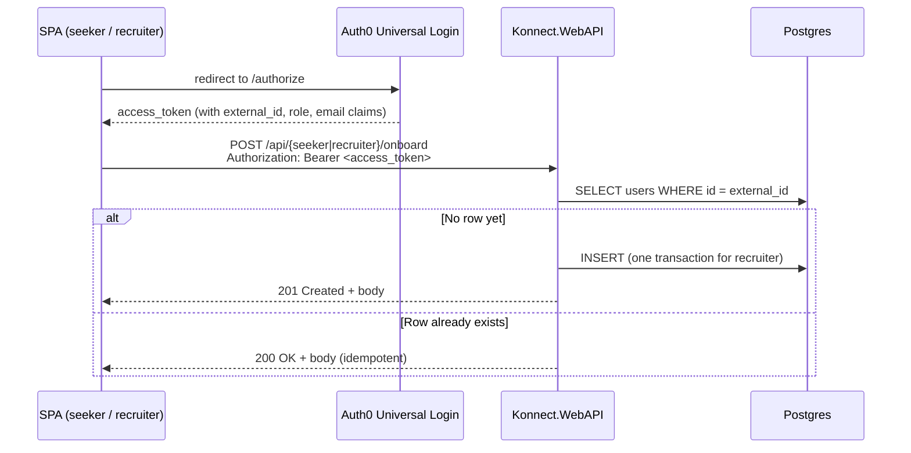

# Onboarding

Auth0 owns identity for Konnect — the two SPAs (seeker + recruiter) sign users up via Auth0 Universal Login, never against our API. After Auth0 issues the first access token, the SPA hits **one** of these onboarding endpoints to provision the corresponding domain row in our Postgres. Without that handshake, an Auth0-authenticated user has a valid JWT but no `JobSeekerUser` / `RecruiterUser` row, so every recruiter- or seeker-scoped feature dereferences nothing.

Both endpoints are **idempotent on the JWT `external_id` claim**. The SPA is free to retry on network hiccups; the second call returns the same body it returned the first time.

## Sequence



## Recruiter — `POST /api/recruiter/onboard`

Atomically creates one `Company` and one `RecruiterUser` row (the one matching the JWT `external_id`). The recruiter's identity (`Id`, `Email`) comes from the JWT — never from the request body — so a recruiter cannot onboard another user.

**Auth:** `[Authorize(Roles = "Recruiter")]`. Seeker tokens get **403**.

### Request

```http
POST /api/recruiter/onboard
Authorization: Bearer <recruiter access_token>
Content-Type: application/json

{
  "companyName": "Acme Corp",
  "companySlug": "acme",
  "companyDescription": "We make anvils.",
  "companyWebsiteUrl": "https://acme.test",
  "firstName": "Alice",
  "lastName": "Anderson",
  "jobTitle": "Senior Recruiter"
}
```

| Field | Required | Notes |
|---|---|---|
| `companyName` | yes | max 200 |
| `companySlug` | yes | max 120, **unique across all companies** |
| `companyDescription` | no | max 4000 |
| `companyWebsiteUrl` | no | max 500 |
| `firstName` / `lastName` | yes | max 80 each |
| `jobTitle` | yes | max 120 |

### Responses

| Status | When | Body |
|---|---|---|
| `201 Created` | First onboarding for this `external_id`. Company + Recruiter rows created in one transaction. | `RecruiterOnboardingResponse` |
| `200 OK` | This `external_id` already has a `RecruiterUser` row. Body returned unchanged from the first call — request body ignored. | `RecruiterOnboardingResponse` |
| `409 Conflict` | `companySlug` is already owned by a different recruiter. | `{ "error": "slug_conflict", "slug": "...", "message": "..." }` |
| `403 Forbidden` | The Bearer token's role is not `Recruiter` (e.g. a seeker token). | — |
| `401 Unauthorized` | No / invalid Bearer token. | — |

```jsonc
// 201 / 200 body
{
  "recruiterId": "...",
  "company": {
    "id": "...",
    "name": "Acme Corp",
    "slug": "acme",
    "description": "We make anvils.",
    "websiteUrl": "https://acme.test",
    "verified": false,
    "createdAt": "2026-05-08T12:34:56.0000000+00:00"
  }
}
```

`createdAt` is stamped by Postgres (`DEFAULT CURRENT_TIMESTAMP`); the application never sets it. Same trigger keeps `updated_at` fresh on every row UPDATE.

## Job seeker — `POST /api/seeker/onboard`

Creates one `JobSeekerUser` row. No transaction (single insert).

**Auth:** `[Authorize(Roles = "JobSeeker")]`. Recruiter tokens get **403**.

### Request

```http
POST /api/seeker/onboard
Authorization: Bearer <seeker access_token>
Content-Type: application/json

{
  "headline": "Senior Engineer",
  "location": "Sydney",
  "openToWork": true
}
```

All three fields are optional. Empty strings or `null` are stored as empty strings (matches the EF default-value config on the entity).

### Responses

| Status | When |
|---|---|
| `201 Created` | First onboarding for this `external_id`. |
| `200 OK` | Idempotent replay — `JobSeekerUser` row already exists. |
| `403 Forbidden` | Recruiter token sent. |
| `401 Unauthorized` | No / invalid Bearer token. |

## Idempotency contract

Both endpoints look up `users.id = JWT.external_id` first. If a row exists for the *correct* audience subtype, return it as-is with `200`. If a row exists for the *wrong* subtype (e.g. JWT says `Recruiter` but DB has a `JobSeekerUser`), the service throws — Auth0's pre-registration action enforces a single audience per identity, so this state should be impossible and is treated as an upstream bug.

The SPA can retry on any network hiccup. It can also call onboard on every app boot if it wants to be defensive — the second-call cost is one indexed `SELECT` plus a `200`.

## Where the code lives

- Controllers: [`Konnect.WebAPI/Controllers/Onboarding/`](https://github.com/win-son-dev/konnect-server/tree/main/Konnect.Platform/Konnect.WebAPI/Controllers/Onboarding)
- Services: [`Konnect.Services/Onboarding/`](https://github.com/win-son-dev/konnect-server/tree/main/Konnect.Platform/Konnect.Services/Onboarding)
- Service contracts + DTOs: [`Konnect.Infrastructure/Services/Onboarding/`](https://github.com/win-son-dev/konnect-server/tree/main/Konnect.Platform/Konnect.Infrastructure/Services/Onboarding)
- Repository contracts: [`IUserRepository`](https://github.com/win-son-dev/konnect-server/blob/main/Konnect.Platform/Konnect.Infrastructure/Repositories/IUserRepository.cs), [`ICompanyRepository`](https://github.com/win-son-dev/konnect-server/blob/main/Konnect.Platform/Konnect.Infrastructure/Repositories/ICompanyRepository.cs)
- DB-managed timestamps migration: [`20260508121429_AddDbManagedTimestamps`](https://github.com/win-son-dev/konnect-server/blob/main/Konnect.Platform/Konnect.Repositories/Migrations/20260508121429_AddDbManagedTimestamps.cs)
- Tests: [`Konnect.Tests/WebAPI/Onboarding/`](https://github.com/win-son-dev/konnect-server/tree/main/Konnect.Platform/Konnect.Tests/WebAPI/Onboarding) (integration), [`Konnect.Tests/Services/Onboarding/`](https://github.com/win-son-dev/konnect-server/tree/main/Konnect.Platform/Konnect.Tests/Services/Onboarding) (unit)
