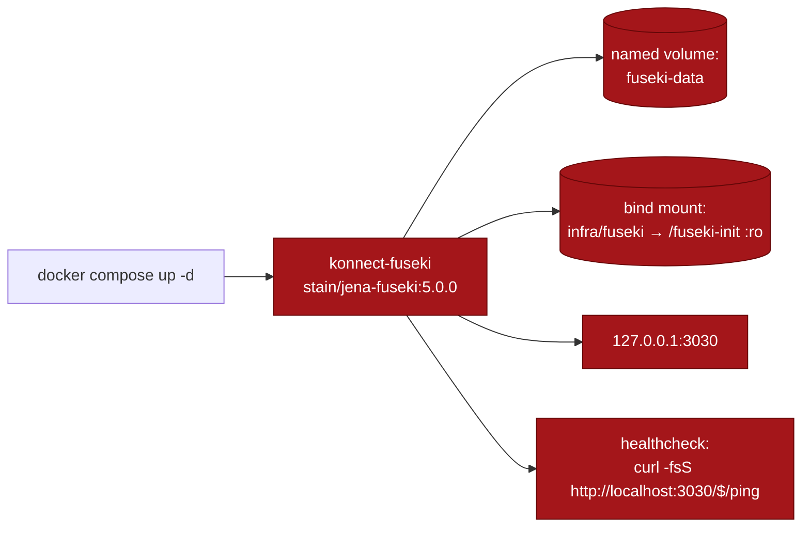
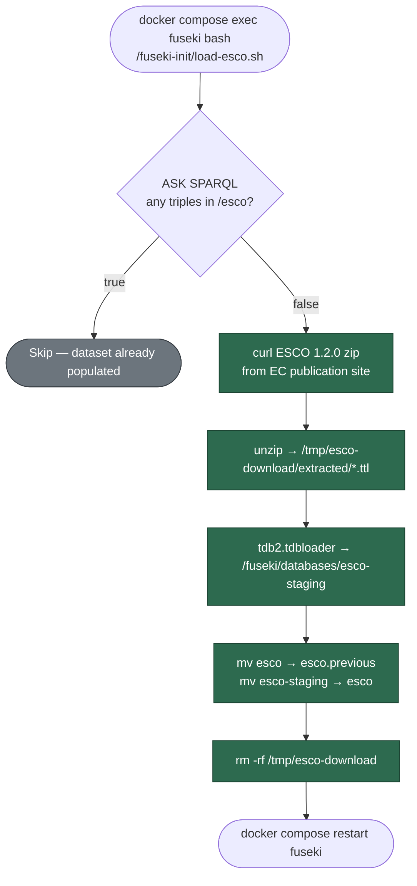

# Apache Jena Fuseki

> Server running locally via docker compose. The ESCO load script exists and works on demand. No SPARQL client exists in the .NET code yet — the planned `SkillsGraph` namespace inside `Konnect.Services` will be documented here when it's added.

## What's running

The image is `stain/jena-fuseki:5.0.0` — Apache Jena Fuseki 5 with the TDB2 storage engine. The dataset slot named `esco` is pre-declared so the loader script can populate it without the operator manually creating the dataset first.



The `infra/fuseki` directory on the host is mounted **read-only** into the container at `/fuseki-init` — that's how the loader script becomes available to `docker compose exec`.

## Connection

| Setting | Value |
|---|---|
| Web UI | http://127.0.0.1:3030 |
| Admin password | `konnect_dev_only` |
| SPARQL query endpoint | `http://127.0.0.1:3030/esco/sparql` |
| SPARQL update endpoint | `http://127.0.0.1:3030/esco/update` |
| Dataset name | `esco` (pre-declared via `FUSEKI_DATASET_1=esco`) |
| JVM heap | 2 GB (`JVM_ARGS=-Xmx2g`) |

## Healthcheck

Compose runs `curl -fsS http://localhost:3030/$/ping` every 10s after a 15s startup grace period — `$/ping` is Fuseki's built-in liveness endpoint.

## ESCO loader

[`Konnect.Platform/infra/fuseki/load-esco.sh`](https://github.com/win-son-dev/konnect-server/blob/main/Konnect.Platform/infra/fuseki/load-esco.sh) is bind-mounted into the container at `/fuseki-init/load-esco.sh`. It downloads the [ESCO](https://esco.ec.europa.eu/) RDF bundle (version 1.2.0, pinned in the script), loads it into a staging TDB2 store, and atomically swaps it into the live `esco` dataset. The script is **idempotent** — re-running on a populated dataset is a no-op.



The atomic-swap pattern (load into `esco-staging`, rename `esco` → `esco.previous`, rename `esco-staging` → `esco`) means a failed import never leaves the live dataset in a half-loaded state. The previous dataset stays around as `esco.previous` so it can be promoted back manually if a new release proves problematic.

```bash
# Run the loader (one-time per environment, or after wiping the volume)
docker compose exec fuseki bash /fuseki-init/load-esco.sh
```

## Volume

The named volume `fuseki-data:/fuseki` persists the TDB2 store across restarts. After the loader runs, the directory looks like:

```
/fuseki/
├── databases/
│   ├── esco/                # live dataset
│   ├── esco.previous/       # last successful import (kept for rollback)
│   └── esco-staging/        # only present mid-import
└── system/                  # Fuseki internal state
```

Wiping the volume forces a re-import on the next loader run.

## Common operations

```bash
# Quick "any triples?" check against the live dataset
curl -fsS "http://127.0.0.1:3030/esco/sparql" \
  --data-urlencode "query=ASK { ?s ?p ?o }" \
  -H "Accept: application/sparql-results+json" | jq .

# Count triples
curl -fsS "http://127.0.0.1:3030/esco/sparql" \
  --data-urlencode "query=SELECT (COUNT(*) AS ?n) WHERE { ?s ?p ?o }" \
  -H "Accept: application/sparql-results+json" | jq -r '.results.bindings[0].n.value'

# Open the web UI (admin password: konnect_dev_only)
open http://127.0.0.1:3030
```

## Code touchpoints

| File | Role |
|---|---|
| [`Konnect.Platform/docker-compose.yml`](https://github.com/win-son-dev/konnect-server/blob/main/Konnect.Platform/docker-compose.yml) | Container, healthcheck, volume, dataset env var, init bind mount |
| [`Konnect.Platform/infra/fuseki/load-esco.sh`](https://github.com/win-son-dev/konnect-server/blob/main/Konnect.Platform/infra/fuseki/load-esco.sh) | Idempotent ESCO loader |

## Attribution

ESCO is © European Union, licensed under [Creative Commons Attribution 4.0 International](https://creativecommons.org/licenses/by/4.0/). The dataset isn't bundled in the repo — it's downloaded at loader-run time. Attribution will also live in the root `README.md` once that page exists.
