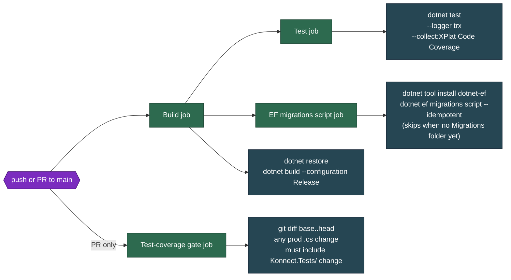
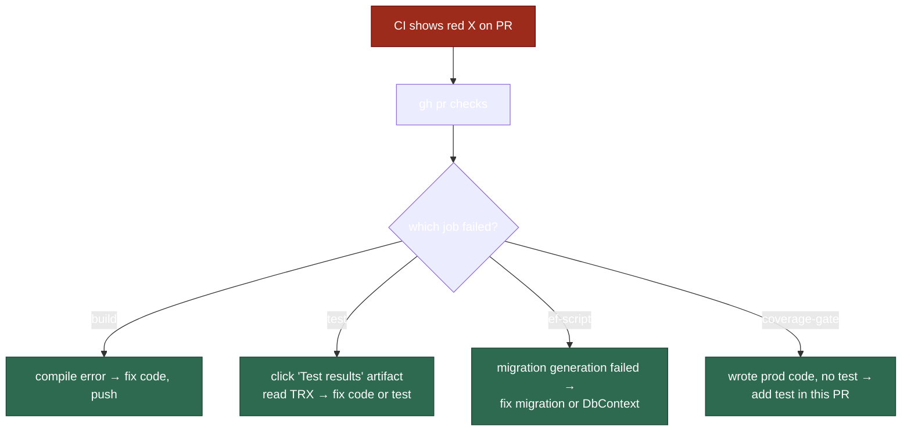

# CI Pipeline

> [`/.github/workflows/ci.yml`](https://github.com/win-son-dev/konnect-server/blob/main/.github/workflows/ci.yml) runs on every `pull_request` and `push` to `main`.

## Purpose

A single GitHub Actions workflow that gates merges to `main`. It enforces three things:

1. **The code builds and the tests pass** in `Release` configuration.
2. **EF Core migrations apply cleanly** from any baseline (idempotent script generation).
3. **Every production code change ships with tests** — a structural diff check, not a coverage-percentage threshold.

GitHub Actions is free for public repositories with no minute cap, so this runs on every push without billing concerns.

## Jobs



| Job | Runs on | What it does |
|---|---|---|
| `build` | every trigger | Restores, builds the whole solution in Release |
| `test` | every trigger (after `build`) | `dotnet test` with TRX logger and Cobertura coverage; uploads `TestResults/**` as an artifact |
| `ef-script` | every trigger (after `build`) | Installs `dotnet-ef` and runs `migrations script --idempotent`. No-op until the first DbContext + migration exists |
| `coverage-gate` | **PRs only** | Diffs the PR against its base branch — fails if any `Konnect.Platform/Konnect.{Infrastructure,Services,Repositories,WebAPI,Serverless,Worker,GraphQL}/*.cs` changed without a matching change under `Konnect.Platform/Konnect.Tests/` |

The `coverage-gate` job is intentionally a **structural diff check** rather than a percentage threshold. Percentage gates encourage gaming (writing tests for trivial getters to hit a number); a structural check enforces the actually-meaningful rule: **if you changed prod code, you wrote a test for it in the same PR.**

## Why these specific jobs

| Concern | Caught by |
|---|---|
| Code doesn't compile in Release | `build` |
| New code breaks an existing test | `test` |
| Migrations have ordering / SQL syntax bugs | `ef-script` |
| Someone shipped a bug fix without writing a regression test | `coverage-gate` |
| EF Core / Npgsql / pgvector mapping bugs | `test` (via Testcontainers Postgres in repository tests, once those exist) |
| MassTransit consumer wiring bugs | `test` (via in-memory test harness, once those exist) |
| Architecture drift (e.g. Konnect.WebAPI suddenly references Konnect.Serverless) | `test` (via [`SolutionStructureTests`](https://github.com/win-son-dev/konnect-server/blob/main/Konnect.Platform/Konnect.Tests/Architecture/SolutionStructureTests.cs)) |

## NuGet caching

Every job that calls `dotnet restore` caches `~/.nuget/packages` on a key derived from `**/Directory.Packages.props` + `**/*.csproj`. When package versions don't change, the cache hits and restore takes seconds instead of a minute.

```yaml
- uses: actions/cache@v4
  with:
    path: ~/.nuget/packages
    key: ${{ runner.os }}-nuget-${{ hashFiles('**/Directory.Packages.props', '**/*.csproj') }}
    restore-keys: ${{ runner.os }}-nuget-
```

## SDK pinning

The workflow uses `setup-dotnet@v4` with `global-json-file: Konnect.Platform/global.json` — the SDK version comes from one source of truth (`global.json` pins `10.0.201`). Bumping the SDK is one-file change; CI picks it up automatically.

## Permissions

```yaml
permissions:
  contents: read
```

The workflow only reads the repository — no write tokens, no PAT, no deploy credentials. The default `GITHUB_TOKEN` is sufficient. Future jobs that need to write (e.g. publishing the wiki) get `permissions:` declared in their own workflow file, scoped to what they need.

## Reading a failed CI run



```bash
# Watch CI on the current PR
gh pr checks --watch

# Re-run failed jobs without re-pushing
gh run rerun <run-id> --failed

# Tail logs of the most recent run
gh run view --log
```

## What's not in CI yet

| Concern | Plan |
|---|---|
| Container build + push | When `Konnect.WebAPI` and `Konnect.Worker` ship Dockerfiles; pushed to GitHub Container Registry on tags |
| Wiki publish | [`.github/workflows/publish-wiki.yml`](https://github.com/win-son-dev/konnect-server/blob/main/.github/workflows/publish-wiki.yml) — separate workflow added in this PR, syncs `wikis/**` to the GitHub Wiki on push to `main` |
| Branch protection enforcement | Will require `build`, `test`, `ef-script`, and `coverage-gate` as required status checks, plus 1 review and a force-push block |
| Security scanning (Dependabot, CodeQL) | not yet enabled |

## Required status checks

Once branch protection is enabled:

- ✅ `Build` — must pass
- ✅ `Test` — must pass
- ✅ `EF migrations script` — must pass
- ✅ `Test-coverage gate (production change must include tests)` — must pass on PRs

`coverage-gate` is intentionally PR-only; pushes directly to `main` (which shouldn't happen, but might via admin override) skip it because there's no base SHA to diff against.

## Code touchpoints

| File | Role |
|---|---|
| [`/.github/workflows/ci.yml`](https://github.com/win-son-dev/konnect-server/blob/main/.github/workflows/ci.yml) | The workflow itself |
| [`/.github/workflows/publish-wiki.yml`](https://github.com/win-son-dev/konnect-server/blob/main/.github/workflows/publish-wiki.yml) | Wiki sync workflow (added by this branch) |
| [`Konnect.Platform/global.json`](https://github.com/win-son-dev/konnect-server/blob/main/Konnect.Platform/global.json) | Pins the SDK version that CI uses |
| [`Konnect.Platform/Directory.Packages.props`](https://github.com/win-son-dev/konnect-server/blob/main/Konnect.Platform/Directory.Packages.props) | Central package versions — every job restores against this |
