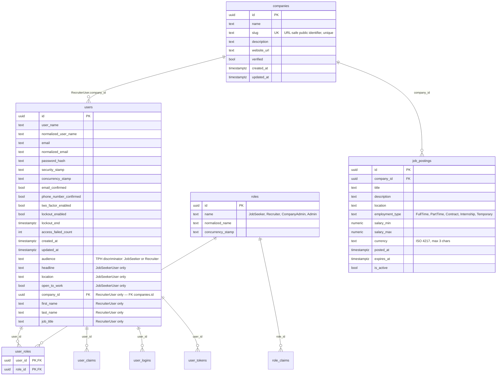

# Database schema

The schema produced by the `InitialCreate` migration. Two domain tables (`companies`, `job_postings`) plus the seven ASP.NET Identity tables, all mapped to snake_case via `EFCore.NamingConventions`. The User hierarchy is **TPH** — one `users` table with an `audience` discriminator column carrying both `JobSeekerUser` and `RecruiterUser` rows.

## Entity-relationship diagram



## Tables

| Table | Source | Purpose |
|---|---|---|
| `users` | ASP.NET Identity + TPH | All user accounts. `audience` column tells you the concrete type. |
| `roles` | ASP.NET Identity | Role definitions (seeded by `RoleSeederService` on every app start) |
| `user_roles` | ASP.NET Identity | M:N user → role membership |
| `user_claims`, `role_claims` | ASP.NET Identity | Per-user / per-role JWT claims |
| `user_logins` | ASP.NET Identity | External login providers (unused in Phase 1) |
| `user_tokens` | ASP.NET Identity | Refresh tokens, MFA tokens (used in Phase 1 by [`#22`](https://github.com/win-son-dev/konnect-server/issues/22) / [`#23`](https://github.com/win-son-dev/konnect-server/issues/23)) |
| `companies` | Konnect domain | Employer organisations. Many recruiters per company; many job postings per company. |
| `job_postings` | Konnect domain | Posted jobs. Indexed on `(company_id, is_active)` for the recruiter dashboard. |

## TPH (table-per-hierarchy)

`users` holds rows of two concrete types — `JobSeekerUser` and `RecruiterUser` — discriminated by the `audience` column (string: `"JobSeeker"` or `"Recruiter"`). Per-type columns are NULL for the wrong type:

- A JobSeeker row has `headline`, `location`, `open_to_work` set; `company_id`, `first_name`, `last_name`, `job_title` are NULL.
- A Recruiter row has those four set; the JobSeeker columns are NULL.

EF Core handles this transparently in code: `dbContext.Set<JobSeekerUser>()` queries with `WHERE audience = 'JobSeeker'`; `dbContext.Set<RecruiterUser>()` with `WHERE audience = 'Recruiter'`. The base `User` is abstract — you can never instantiate it.

## Multi-recruiter Company

`users.company_id` is a M:1 foreign key to `companies.id` (only set when `audience = 'Recruiter'`). One company has many recruiters. The first recruiter is created atomically with the Company at employer signup ([`#23`](https://github.com/win-son-dev/konnect-server/issues/23)); additional recruiters arrive via the deferred Phase 1.5 invitation flow.

Indexed on `company_id` so "all recruiters at this company" is a single index scan.

## Indexes

| Index | Purpose |
|---|---|
| `ix_users_normalized_user_name` (unique) | Login lookup |
| `ix_users_normalized_email` | Email lookup |
| `ix_users_company_id` | Recruiters at a company |
| `ix_user_roles_role_id` | Reverse lookup (who's a CompanyAdmin?) |
| `ix_companies_slug` (unique) | Public company URL lookup |
| `ix_job_postings_company_id_is_active` | Recruiter dashboard ("my company's active postings") |

## What's NOT here yet

The schema is intentionally minimal for Phase 1. These columns / tables land in later phases — adding them now would be premature:

- `resumes`, `resume_documents`, `applications`, `saved_jobs`, `job_alerts`, `application_messages`, `notifications`, `messages` — Phase 2 / cross-cutting Stories.
- `embedding vector(768)` columns + HNSW indexes on `job_postings` and `resumes` — Phase 3 (when the AI layer ships).
- `search_tsv tsvector` GENERATED column + GIN index on `job_postings` — Phase 4 (lexical search).
- `skills`, `occupations` Postgres mirrors of ESCO — Phase 4.
- MassTransit-managed outbox tables — Phase 2 ([`#32`](https://github.com/win-son-dev/konnect-server/issues/32)).

## Migration

The single `InitialCreate` migration lives at [`Konnect.Platform/Konnect.Repositories/Migrations/`](https://github.com/win-son-dev/konnect-server/tree/main/Konnect.Platform/Konnect.Repositories/Migrations). Generate a SQL script with:

```bash
dotnet ef migrations script \
  --project Konnect.Platform/Konnect.Repositories/Konnect.Repositories.csproj \
  --startup-project Konnect.Platform/Konnect.WebAPI/Konnect.WebAPI.csproj \
  --idempotent
```

CI runs this on every PR to verify the migration is well-formed (the [CI Pipeline page](CI-Pipeline) describes the job).

## Code touchpoints

| File | Role |
|---|---|
| [`Konnect.Infrastructure/Entities/`](https://github.com/win-son-dev/konnect-server/tree/main/Konnect.Platform/Konnect.Infrastructure/Entities) | Entity types — `User` (abstract), `JobSeekerUser`, `RecruiterUser`, `Company`, `JobPosting` |
| [`Konnect.Repositories/Configurations/`](https://github.com/win-son-dev/konnect-server/tree/main/Konnect.Platform/Konnect.Repositories/Configurations) | Fluent EF configurations — TPH discriminator, indexes, FKs, string lengths |
| [`Konnect.Repositories/KonnectDbContext.cs`](https://github.com/win-son-dev/konnect-server/blob/main/Konnect.Platform/Konnect.Repositories/KonnectDbContext.cs) | The EF session. Forces snake_case naming on the Identity tables. |
| [`Konnect.Repositories/RepositoriesServiceCollectionExtensions.cs`](https://github.com/win-son-dev/konnect-server/blob/main/Konnect.Platform/Konnect.Repositories/RepositoriesServiceCollectionExtensions.cs) | `AddKonnectRepositories(connectionString)` — single DI entry point |
| [`Konnect.Services/Identity/RoleSeederService.cs`](https://github.com/win-son-dev/konnect-server/blob/main/Konnect.Platform/Konnect.Services/Identity/RoleSeederService.cs) | Seeds the four required roles idempotently on app start |
| [`Konnect.WebAPI/HostedServices/DataSeederHostedService.cs`](https://github.com/win-son-dev/konnect-server/blob/main/Konnect.Platform/Konnect.WebAPI/HostedServices/DataSeederHostedService.cs) | Boot-time orchestrator; runs every seeder before the HTTP listener opens |
