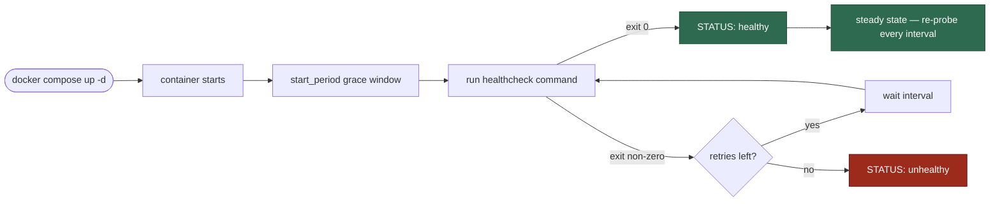

# Docker Compose

> [`Konnect.Platform/docker-compose.yml`](https://github.com/win-son-dev/konnect-server/blob/main/Konnect.Platform/docker-compose.yml) brings the full local infrastructure stack up with one command.

## Purpose

A single file that defines every long-running infrastructure dependency Konnect needs locally — Postgres, RabbitMQ, Fuseki, plus an opt-in Ollama for local AI. Versions are pinned, ports are bound to localhost, healthchecks are defined, and named volumes preserve state across restarts. The goal: a new contributor runs one command and has a working dev environment in under five minutes.

## File layout

```yaml
name: konnect              # project name → container prefix konnect-*
networks:
  konnect:                 # one bridge network so services resolve each other by name
    driver: bridge
volumes:
  postgres-data:           # named volumes survive `docker compose down`
  rabbitmq-data:
  fuseki-data:
  ollama-data:
services:
  postgres:    ...
  rabbitmq:    ...
  fuseki:      ...
  ollama:      ... profiles: ["ai-local"]    # opt-in, not started by default
```

## Conventions

Every service block follows the same shape so they're easy to compare and audit:

| Field | Why we always set it |
|---|---|
| `image: <name>:<exact-tag>` | Reproducible builds — never `:latest` in compose |
| `container_name: konnect-<service>` | Predictable names for `docker exec`, log tailing, scripts |
| `restart: unless-stopped` | Survives Docker daemon restarts during dev |
| `ports: - "127.0.0.1:host:container"` | **Localhost-only binding** — never reachable from the LAN |
| `volumes: - <named>:<container-path>` | Named volumes (not bind mounts) so OS path quirks don't matter |
| `healthcheck:` | `docker compose ps` reports `(healthy)` only when the service is actually serving |
| `networks: [konnect]` | Single shared bridge so services can find each other by hostname |

## Profiles

Compose profiles let one file describe both a "default" stack and an "everything" stack. Konnect uses one profile:

| Profile | Brings up | When to use |
|---|---|---|
| *(none)* | postgres, rabbitmq, fuseki | Default — `docker compose up -d` |
| `ai-local` | + ollama (heavy: ~5–10 GB once a model is pulled) | When working on AI features locally and you don't want to burn Gemini quota |

```bash
# Default: core services
docker compose up -d

# Add ollama for local AI work
docker compose --profile ai-local up -d
```

## Local-only ports — why this matters

Every published port in this file binds explicitly to `127.0.0.1`, not the default `0.0.0.0`. This is non-negotiable.

```yaml
ports:
  - "127.0.0.1:5432:5432"     # ✓ bound to loopback only
# - "5432:5432"               # ✗ would bind to 0.0.0.0 — reachable from LAN
```

The credentials in this file (`konnect_dev_only`) are convenience defaults for development. They are **not** safe outside the developer's machine. If a misconfigured port binding exposed the broker or the database to the LAN, anyone on the same network could connect with the documented credentials.

Production deployments never use this file — production credentials live in Azure Key Vault / GitHub Secrets and are injected via environment overrides into the actual hosting platform (Azure Container Apps / managed Postgres).

## Healthcheck mechanics



| Service | Probe | Why |
|---|---|---|
| `postgres` | `pg_isready -U konnect -d konnect` | Confirms Postgres is accepting connections, not just running |
| `rabbitmq` | `rabbitmq-diagnostics -q ping` | Confirms the broker is fully booted (it boots slowly) |
| `fuseki` | `curl -fsS http://localhost:3030/$/ping` | Confirms the SPARQL endpoint is serving |
| `ollama` | `ollama list` | Confirms the LLM runtime is responsive |

`docker compose ps` shows the health column — wait for everything to say `(healthy)` before running the WebAPI.

## Common operations

```bash
# Bring everything up
cd Konnect.Platform
docker compose up -d

# Status (look for `healthy` in the STATUS column)
docker compose ps

# Tail logs from one service
docker compose logs -f postgres

# Open a shell inside a container
docker compose exec postgres bash

# Stop everything (volumes preserved)
docker compose down

# Stop AND wipe volumes (data loss — use with intent)
docker compose down -v

# Restart one service (e.g. after editing the compose file)
docker compose up -d --force-recreate fuseki
```

## When to add or change a service

1. Open a GitHub issue first describing why the new service is needed and what code will use it.
2. Pin the image to an exact tag (no `:latest`).
3. Bind ports to `127.0.0.1` only.
4. Add a healthcheck that proves the service is actually serving, not just running.
5. Use a named volume if state needs to survive `docker compose down`.
6. Update [the Overview page](Overview) and [Local Development](../Local-Development) to mention the new ports / credentials.
7. Verify `docker compose up -d` reports the new service `(healthy)` within a sensible window.

## What lives outside this file

| Concern | Where |
|---|---|
| ESCO loader script (run once per environment) | [`Konnect.Platform/infra/fuseki/load-esco.sh`](https://github.com/win-son-dev/konnect-server/blob/main/Konnect.Platform/infra/fuseki/load-esco.sh) — invoked via `docker compose exec fuseki bash /fuseki-init/load-esco.sh` |
| EF Core schema | `Konnect.Repositories/Migrations/` — applied via `dotnet ef database update`, never via compose init scripts |
| App configuration | `Konnect.WebAPI/appsettings*.json` + environment variables, not compose env blocks |
