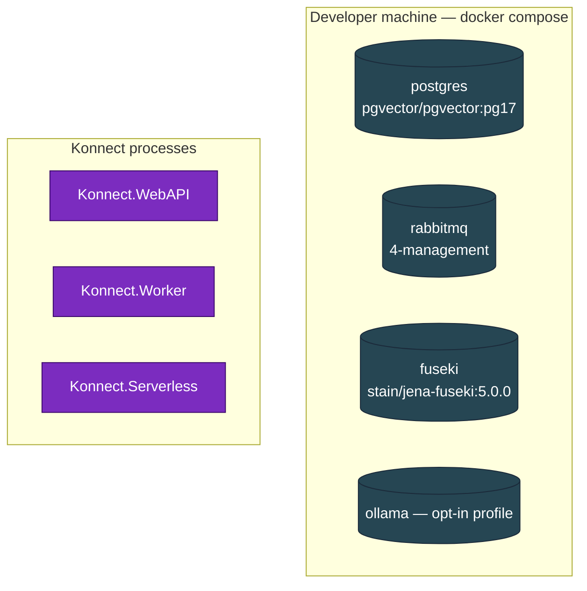

# Infrastructure Overview

## What runs locally

| Component | Image / runtime | Local port (127.0.0.1) | Page |
|---|---|---|---|
| PostgreSQL + pgvector | `pgvector/pgvector:pg17` | 5432 | [PostgreSQL](PostgreSQL) |
| RabbitMQ | `rabbitmq:4-management` | 5672 (AMQP), 15672 (UI) | [RabbitMQ](RabbitMQ) |
| Apache Jena Fuseki | `stain/jena-fuseki:5.0.0` | 3030 | [Apache Jena Fuseki](Apache-Jena-Fuseki) |
| Ollama (opt-in) | `ollama/ollama:latest` | 11434 | — |

## Tooling not in compose

| Component | Where | Page |
|---|---|---|
| Docker Compose file itself | [`Konnect.Platform/docker-compose.yml`](https://github.com/win-son-dev/konnect-server/blob/main/Konnect.Platform/docker-compose.yml) | [Docker Compose](Docker-Compose) |
| GitHub Actions CI | [`.github/workflows/ci.yml`](https://github.com/win-son-dev/konnect-server/blob/main/.github/workflows/ci.yml) | [CI Pipeline](CI-Pipeline) |
| GitHub Actions wiki publish | [`.github/workflows/publish-wiki.yml`](https://github.com/win-son-dev/konnect-server/blob/main/.github/workflows/publish-wiki.yml) | (covered in [Home](../Home)) |

## Local-only by design

Every published port in the compose file binds to `127.0.0.1:<host>:<container>` rather than `0.0.0.0`. Nothing in the dev stack is reachable from the LAN — the credentials in the compose file (`konnect_dev_only`) are convenience defaults and not safe outside the developer's machine.
