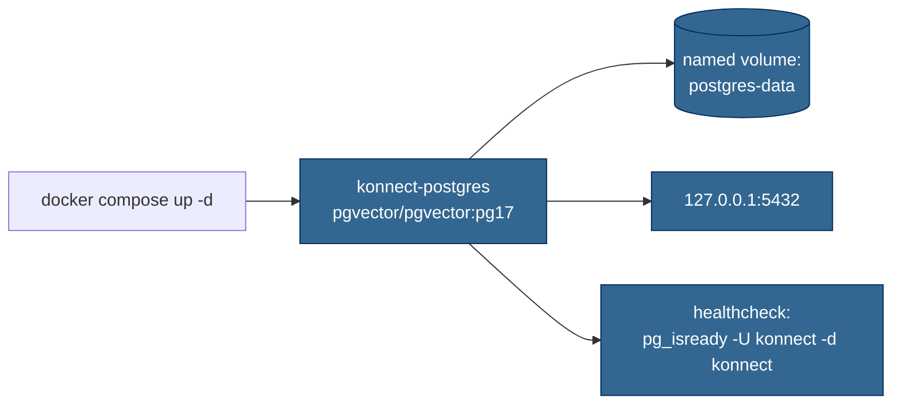

# PostgreSQL

## What's running

The image is `pgvector/pgvector:pg17` — official PostgreSQL 17 with the `pgvector` extension pre-installed. We picked this image (rather than vanilla `postgres:17` plus a custom init script) because the application needs vector storage and pre-baked is simpler than maintaining init scripts.



## Connection

| Setting | Value |
|---|---|
| Host | `127.0.0.1` |
| Port | `5432` |
| Database | `konnect` |
| User | `konnect` |
| Password | `konnect_dev_only` *(dev only — production uses Key Vault)* |
| Container data dir | `/var/lib/postgresql/data/pgdata` |

Connection string for local dev:

```
Host=127.0.0.1;Port=5432;Database=konnect;Username=konnect;Password=konnect_dev_only
```

## Healthcheck

Compose runs `pg_isready -U konnect -d konnect` every 5s after a 5s startup grace period. `docker compose ps` shows `(healthy)` when the database is accepting connections.

## Volume

The named volume `postgres-data:/var/lib/postgresql/data` survives `docker compose down` and `docker compose up -d`. To wipe and start fresh:

```bash
docker compose down -v   # -v removes named volumes; data is gone
docker compose up -d
```

## Common operations

```bash
# Open a psql shell against the running container
docker compose exec postgres psql -U konnect -d konnect

# Confirm pgvector is available
docker compose exec postgres psql -U konnect -d konnect \
  -c "SELECT extname, extversion FROM pg_extension ORDER BY extname;"
```

## Code touchpoints

| File | Role |
|---|---|
| [`Konnect.Platform/docker-compose.yml`](https://github.com/win-son-dev/konnect-server/blob/main/Konnect.Platform/docker-compose.yml) | Container definition, healthcheck, volume |

The `Konnect.Repositories` project exists but currently contains only the csproj. The `KonnectDbContext`, migrations, and repository implementations will be documented here when they're added.
