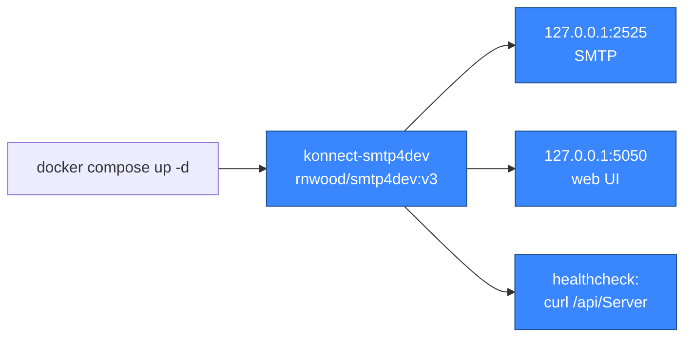

# smtp4dev

> Local SMTP catcher running via docker compose. Outbound mail in dev never leaves the developer's machine — it lands in smtp4dev's inbox so we can inspect it. No code in the repo sends mail yet; the page will expand when the notifications/alerts pipeline ships.

## What's running

The image is `rnwood/smtp4dev:v3` — a fake SMTP server with a web UI that captures every message sent to it instead of relaying. Production uses a real provider (e.g. SendGrid) wired through the same `notification.email` exchange.



## Connection

| Setting | Value |
|---|---|
| SMTP host | `127.0.0.1` |
| SMTP port | `2525` |
| Web UI | http://127.0.0.1:5050 |
| Auth | none (dev only) |
| TLS | none (dev only) |

The container's internal SMTP port is `25`; the host port `2525` avoids the privileged-port range. Application config in dev should target port `2525`.

## Healthcheck

Compose runs `curl -fsS http://localhost:80/api/Server` every 30s after a 15s startup grace period — the smtp4dev management API responds once the SMTP listener is up.

## Volume

None. smtp4dev keeps captured messages in memory; restarting the container clears the inbox. That's intentional — the inbox is meant to be ephemeral, not a long-term archive.

## Common operations

```bash
# Open the inbox
open http://127.0.0.1:5050

# Send a smoke-test email from the host (requires `swaks`)
swaks --to test@konnect.local --from dev@konnect.local \
      --server 127.0.0.1:2525 --body "smtp4dev wiring check"
```

## Code touchpoints

| File | Role |
|---|---|
| [`Konnect.Platform/docker-compose.yml`](https://github.com/win-son-dev/konnect-server/blob/main/Konnect.Platform/docker-compose.yml) | Container, healthcheck, port bindings |

No application code talks to smtp4dev yet. When the notifications pipeline lands (an `EmailConsumer` reading `notification.email`), the dev configuration will point its SMTP host at `127.0.0.1:2525` and this page will document the wiring.
